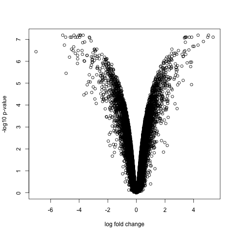
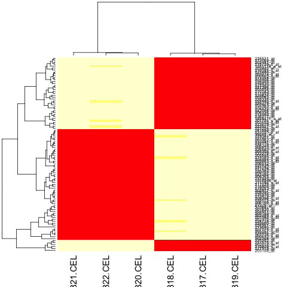

# Downstream analysis of microarray data

So far in our analysis, we have obtained a list of differentially expressed genes. However, having a list of genes is not usually the most informative. Here, we will discuss some plots that are commonly used to visualize the results of differential gene expression analysis. We will also discuss (but not go through their implementation) some commonly employed strategies to interpret the results of differential gene expression analysis. 

## Volcano plots 

A volcano plot is a helpful visualization that shows the log fold-change versus the negative log p-value. Usually, we will expect that genes larger absolute fold changes will have larger negative log p-values and hence implying greater statistical confidence. 

Plotting a volcano plot in R can be easily accomplished using `plot()`, as it is simply a scatterplot with the log fold-change on the x-axis and the negative log p-value on the y-axis. In order to plot the volcano plot, all we need is the `topTable()` result for every probeset on the chip. The code below illustrates how we can do this: 

```R
table.all <- topTable(fitted.ebayes, number = 100000) # use an arbitrarily large number to return all the probesets 
plot(table.all$logFC, -log10(table.all$adj.P.Val), 
	xlab="log fold change", ylab= "-log10 p-value")
```

The resulting volcano plot is shown below.



From the plot above, we can see that many genes tend to show small but statistically insignificant changes in expression level between the two conditions. On the other hand, a small subset of the genes show very large fold changes with relatively small p-values. These genes tend to be further analyzed for their potential role in the biological phenomenon of interest. 

## Heatmaps 
Heatmaps are the most common manner by which microarray data is presented in publications. They reveal two pieces of information: which samples are clustered together, and what how are the expression profiles like for these differentially expressed genes. Plotting a basic heatmap (though, not necessarily the nicest looking) in R is simple. All that we need to do is to provide a matrix containing the expression values of the genes of interest to the `heatmap()` function. 

> ## Choosing the genes of interest for analysis. 
>
> How do we choose which genes we should be included in our heatmap? Ideally, we will have
> all the differentially expressed genes on it. However, in some cases, that is not
> feasible. For example, we have identified over 2000 genes to be differentially
> expressed. Another strategy might be to use genes that show the most variance, as it is
> most likely that we can use these highly variable genes to cluster our samples into
> distinct groups. Finally, we can visualize simply the top most significantly expressed
> genes, which we will do here.
{: .callout}

For simplicity, we will visualize the expression of the top 100 most significantly different genes. To do so, we will need the following: 

1. The list of all the probesets most differentially expressed between our experimental condition, and;
2. Their normalized expression value. 

Earlier, in annotation, we have found out how we can get the probeset
IDs corresponding to all the differentially expressed genes. Recall
that `topTable()` ranks the result by the B-statistics (by default,
you can change this if you so desire). That is, the first 100 probe
IDs therefore are the most significantly different between the two
groups. Probeset information from `topTable()` can be extracted using
`rownames()`. We can combine these information together to obtain the
probeset ID of the top 100 most differentially expressed genes between
the two experimental groups as follows:

```R
probeset.plotting <- rownames(topTable(fitted.ebayes, number = 100))
```

Thereafter, we will retrieve the normalized expression values using `exprs()`, as follows: 

```R
expression.plotting <- exprs(normalized)[rownames(normalized)%in%probeset.plotting, ]
```

The above code combines both subsetting (`[]`) and matching (`%in%`)
to extract the expression values of only our top 100 most
significantly different genes from the normalized expression data.

Finally, we use the `heatmap()` function to plot our heatmap.

```
heatmap(expression.plotting)
```

The resulting plot should look like the following: 



We notice from the heatmap two distinct clusters of samples, each corresponding to their experimental condition (control versus KO). Noticeably, we see distinct trends in the expression of of genes between the control and the KO samples. Further analysis of these genes showing such distinct patterns of expression can be performed to yield additional insights (for example, what pathways are these genes found in). 

## What's next?
Although we have discussed the volcano plot, the MA plot and heatmaps, many other downstream analysis can be done. For instance, one commonly used analysis toolkit is the gene set enrichment analysis (GSEA) where we test for whether particular sets of genes are enriched in our list of differentially expressed genes. Ultimately, what downstream analysis is performed is dependent on the question that one wishes to address. New analysis methods are constantly being developed by others, and hence it is important for one to keep abreast on these developments in order to get the most out of our analysis. 
